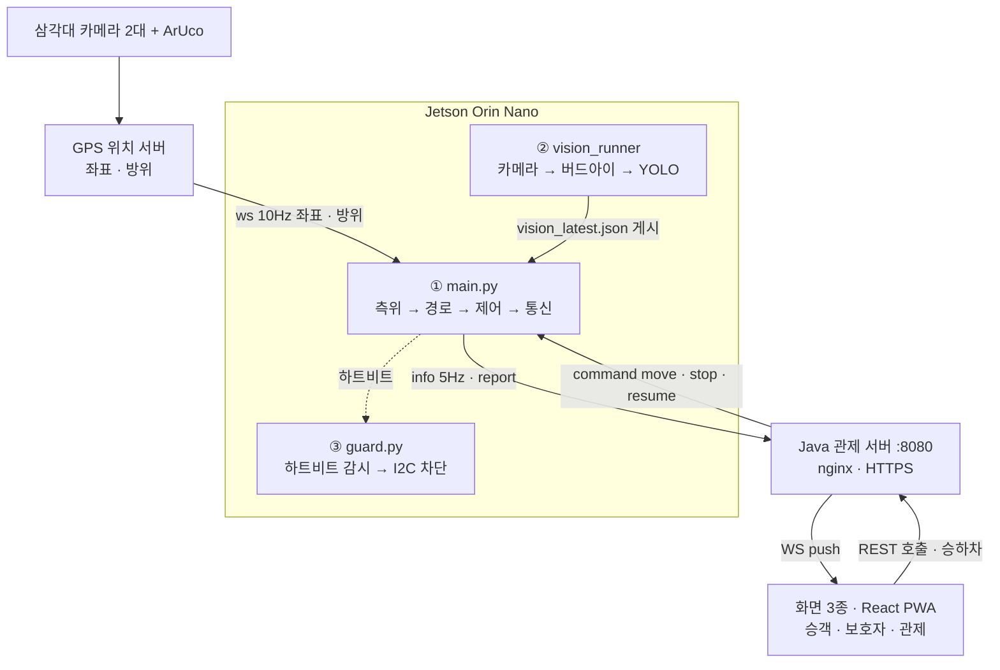

# 다태워 (프로젝트 개요)

> 어르신을 위한 무인 자율주행 이동 서비스.
> 소형 RC카(Jetson Orin Nano)가 실내 5m x 3m 트랙에서 호출 → 픽업 → 하차 전 과정을 무인 수행.

- **기간**: 2026.07.06 \~ 2026.08.10 (SSAFY 15기 공통프로젝트, 5인 팀)
- **핵심 명제**: 교통 공급량을 운전자 수로부터 분리
  - 고령 운전자 면허 반납 이후의 이동권 문제를 기사 공급 감소라는 구조적 한계에서 출발해 무인 택시로 접근
  - 근거: 법인택시 기사 7년 새 36.5% 감소, 개인택시 기사의 51.7%가 65세 이상
- **최종 결과**: 시연 주행 무개입 완주. 목표 정차점 도착 오차 면사무소 12.2cm · 우리집 8.7cm, 관제 왕복 통신(complete-stop) 전건 성공
- **담당**: 차량 임베디드 전체 (측위·경로계획·주행제어·안전·통신)

---

## 1. 시스템 아키텍처

구성 요소 간 장애 전파 차단을 위해 3개 프로세스와 2개 서버로 물리 분리.

비전 게시 약 5Hz, 차량 소비 10Hz. 기록 후 0.5초 경과 게시물은 invalid 처리.

게시 위치는 메모리 기반 파일시스템 tmpfs(`/dev/shm`). 초당 수 회 갱신에 따른 저장매체 쓰기와 접근 지연 회피 목적.

| 노드 | 역할 | 장애 시 |
|---|---|---|
| GPS 위치 서버 | 삼각대 듀얼 카메라 + ArUco 마커로 차량 좌표·방위를 10Hz push | 주행 차단 후 0.6초 지속 시 오류 정지. `tunnel.zones` 구역 내 유실은 터널 모드(추측항법)로 대체, 한도 초과 시 정지 |
| 관제 서버 | 라이드 상태머신, 경로 명령, 화면 3종 서빙 | 차량이 최대 3초 내 자체 정지 후 복구 신호 대기 |
| ① 차량 본체 | 측위·경로·제어·관제 통신 (50Hz 제어 루프) | guard 가 모터 차단 |
| ② 비전 프로세스 | 카메라 단독 소유, 추론 결과를 tmpfs 에 게시 | 게시 파일 stale 처리, 좌표 기반 대체 동작으로 주행 지속 |
| ③ guard | 독립 프로세스, 하트비트 감시 | 전체 동결 대비 최후 차단 수단 상실 (주행은 지속) |

---

## 2. 기능 분해

서비스 층(택시 서비스 기능)과 자율주행 층(차량 주행 기능)으로 구분.

### 2-1. 서비스 층

| 기능 | 내용 | 구현 위치 |
|---|---|---|
| ① 호출 | 앱 설치·회원가입·로그인 없이 문자 링크에서 3탭. 목적지는 6곳 고정(우리집·보건소·경로당·시장·면사무소·은행) | 프론트 `PassengerScreen` + 백엔드 `ride/`, `map/PlaceCatalog` |
| ② 배차·주행 관리 | 라이드 상태머신(호출 → 픽업 → 탑승 → 주행 → 하차). 경로는 관제가 계산해 차량에 명령 | 백엔드 `ride/RideService`, `dispatch/` |
| ③ 탑승·하차 확인 | "탔어요 / 내렸어요" 버튼이 차량 출발·종료 신호로 직결 | 프론트 + 백엔드 `RideController` |
| ④ 보호자 지켜보기 | 승객 선택이 보호자 설정보다 우선. 감춘 이동은 채널별 투영 단계에서 제외해 서버 미전송. 대리 호출 불가 | 백엔드 `telemetry/` 채널별 투영, `GuardianLink` |
| ⑤ 요금·크레딧 | 복지 지원 한도와 서비스 이용 한도의 분리를 위해 지자체 크레딧 차감분과 자부담을 분리 계산 | 백엔드 `fare/` |
| ⑥ 관제 대시보드 | 실시간 차량·라이드 모니터링, 수동 개입(advance / resume), 프로토콜 로그 | 프론트 `OpsScreen` + 백엔드 `api/` WS 4채널 |

### 2-2. 자율주행 층

| 기능 | 내용 | 구현 위치 |
|---|---|---|
| ① 측위 (가상 GPS) | 위성 GPS 오차(수 m)가 5x3m 트랙에 부적합해 삼각대 듀얼 카메라와 ArUco 마커(차량 큐브 4면) 기반 실내 측위 서버를 직접 구현 - 검증 7단계, 아핀 좌표계 보정(잔차 3.5cm) - **터널 모드**(추측항법): 카메라 기반 측위 특성상 카메라 시야 경계와 원거리 구역에서 좌표 왜곡·유실이 발생해, 해당 구역을 `tunnel.zones`(트랙 동·서·남·북 외곽 벨트)로 지정. 구역 내 주행 중 좌표 유실 시 최종 pose 기준으로 실행된 조향·속도 명령을 자전거 모델로 적분해 위치 추정, 한도 1.2m / 30s 초과 시 정지. 구역 밖 유실은 정지 | GPS 서버 + 차량 `localization/` |
| ② 인지 (비전) | CSI 카메라 프레임 4단계 처리 후 결과 게시 - **버드아이 변환**(호모그래피 IPM): 카메라 시점을 노면 수직 상방 시점으로 사영 변환. 954x241px, 지면 깊이 0.89m. 변환 후 픽셀 좌표가 지면 좌표에 선형 대응해 횡오차를 미터로 환산 - **노면표시 검출**: YOLO 세그멘테이션 4클래스(횡단보도·정지선·점선·방향화살표), TensorRT FP16 엔진 - **노란선 검출**: HSV·LAB 색 임계 기반. 흰색 페인트는 색 분리 불가로 세그 모델 담당 - **게시**: 차선 중앙 오차와 검출 상자를 tmpfs 에 원자적 게시 - 캡처 5FPS, 엔진 추론 처리량 8.8FPS 로 추론 지연에 의한 프레임 누락 없음 | `vision_runner` + 차량 `perception/` |
| ③ 경로 계획 | 차선 단위 유향 그래프 기반 경로 계산 - **그래프 구조**: 차선 32개가 노드, 진행 가능한 연결이 간선. 전체 강연결 - **centerline**: 차선 중심선을 시작점·끝점 2점 직선으로 정의. 차선 매칭과 잔여 거리 계산이 선형 연산 - **경로 계산**: 현재 차선에서 목적지 차선까지 Dijkstra 최단 경로 - **TurnTable**: 회전별 준비 거리·개시 조건·조향 파라미터를 개별 정의한 표 | 차량 `mapping/`, `navigation/` |
| ④ 주행 제어 | 차선 번호 point-to-point 추종 + 2단 회전 트리거(1차 GPS 좌표 게이트 → 2차 비전 노면표시 개시) - 일부 회전 구간의 GPS 품질 저하에 의한 차선 이탈 방지를 위해 회전 중 GPS 방위 미참조, 고정 조향 진입 | 차량 `control/LaneFollower`, `behavior/` |
| ⑤ 안전 | 3중 방어 - SafetySupervisor: 모든 모터 출력의 단일 통과점 - SafetyWatchdog: 워커 생존 감시 20Hz - guard.py: 독립 프로세스, 하트비트 0.7s 유실 시 I2C 레지스터 직접 차단 | 차량 `safety/` + `tools/guard.py` |
| ⑥ 통신 | 규약 v2.3. 전 구간 raw WebSocket JSON, 차량이 항상 client - info 5Hz (pose 수신과 독립 타이머) - 처리 1회 / 응답 매번 규칙으로 데드락 방지 | `contracts/` + 차량 `network/` + 백엔드 `vehicle/wire/` |

---

## 3. 기술 스택

| 노드 | 스택 | 규모 |
|---|---|---:|
| 차량 본체 (Jetson Orin Nano) | Python 3.10, 런타임 의존성 4개(pyyaml · websockets · adafruit-circuitpython-pca9685 · adafruit-circuitpython-servokit). OpenCV·PyTorch 는 비전 프로세스로 격리해 주행 런타임에서 배제. 워커 7개 고정 주기 스레드 + StateStore 중앙 상태 | 약 9,000줄 + 테스트 383건 |
| 비전 프로세스 (같은 보드) | Python, OpenCV(GStreamer · 호모그래피), Ultralytics YOLO → TensorRT engine | 약 1,200줄 |
| GPS 위치 서버 (외부 PC) | Python, OpenCV ArUco(DICT_4X4_50), 듀얼 카메라 융합, Raspberry Pi 5 송신기 | 약 5,900줄 |
| 관제 백엔드 (EC2) | Java 25, Spring Boot 4.1, raw WebSocket(STOMP / SockJS 미사용), Jackson 3. **DB 없이 전부 인메모리** | 약 5,000줄 + 테스트 209건 |
| 프론트 | React 19, TypeScript, Vite, Tailwind 4, PWA. 3화면 + 공유 MapView | 약 3,700줄 |
| 인프라 | AWS EC2(Ubuntu 24.04), nginx + Let's Encrypt, systemd, 원격 배포 스크립트 | 해당 없음 |
| 검증 도구 | pytest, JUnit, fake-vehicle(규약 준수 시뮬레이터, 하드웨어 없이 E2E), real / mock / sim 드라이버 3종 교체 | 테스트 총 약 590건 |
| 하드웨어 | PCA9685 I2C 모터·서보 제어, CSI 카메라(Arducam IMX708). 서보 중립 108(물리 118), 실효 조향 클램프 51\~165(`vehicle.yaml`, 벤더 단 48\~168), 축거 0.14m, 최고 속도 0.22m/s(실측) | 해당 없음 |

---

## 4. 연결 관계와 대체 동작 설계

### 4-1. 통신 링크

| 링크 | 프로토콜 | 주기 |
|---|---|---|
| GPS 서버 → 차량 | WebSocket (ws / wss) | 10Hz |
| 관제 ↔ 차량 | WebSocket, 와이어 계약 v2.3 | 텔레메트리 5Hz |
| 비전 → 차량 | tmpfs 파일 원자적 게시 (pull, 최신 여부 판정) | 게시 약 5Hz / 소비 10Hz |
| 승객·보호자·관제 화면 ↔ 관제 | REST + WS 채널 3종 (토큰 링크 + 기기 바인딩) | 해당 없음 |

### 4-2. 대체 동작 사슬 (모든 연결에 대체 동작 존재)

- **비전 중단**: 게시 파일 timestamp stale 로 자동 invalid 판정. GPS 좌표 단독 주행 지속, 회전 트리거는 차선 끝 좌표로 대체
- **GPS 유실**: 수신 즉시 주행 차단, 0.6초(10Hz x 6프레임) 지속 시 오류 정지. `tunnel.zones` 구역 내 주행 중 유실은 터널 모드로 대체(적용된 제어 명령을 자전거 모델로 적분, 한도 1.2m / 30s 초과 시 정지)
- **관제 단절**: ping 1s / timeout 2s 로 감지. 최대 3초(0.62m) 내 자체 정지 후 복구 신호 대기
- **프로세스 전체 동결**: guard.py 가 하트비트 0.7초 유실 시 PCA9685 레지스터에 I2C 로 FULL_OFF 직접 기록

### 4-3. 계층 간 격리 (경계마다 단일 지점)

- **차량 ↔ 관제 경계**: 규약(한글 상태값·서보각·JSON)은 백엔드 `vehicle/wire/` 안에만 존재하는 안티커럽션 계층. 도메인 코드에 규약 미노출
- **좌표계 경계**: 서버 좌표 → 맵 좌표 아핀 변환은 차량 `localization/` 한 곳, 화면 좌표 변환은 프론트 `mapFrame.ts` 한 곳
- **하드웨어 경계**: real / mock / sim 드라이버가 동일 인터페이스로 하드웨어 없이 전 구간 시뮬 가능. 좌표 소스도 인터페이스로 추상화돼 RTK-GNSS 등으로 교체 가능
- **모터 출력 경계**: 드라이버 직접 호출 없이 SafetySupervisor 단일 통과점 경유
