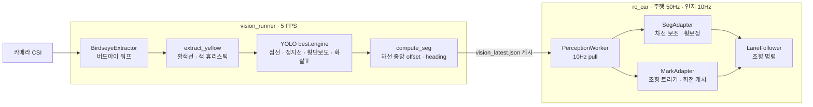
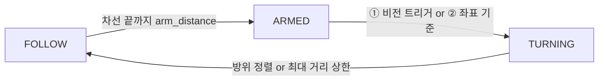

# RC카 자율주행 - 차량 파트 제출본 (2026-08-10)

2026-08-10 시연 완주 차량의 주행 코드와 비전 실행체 묶음.

| 폴더 | 내용 | 실행 위치 |
| --- | --- | --- |
| `rc_car/` | 차량 주행 프로세스 (측위·경로·조향·관제 통신·안전) | Jetson Orin Nano |
| `vision_runner/` | 비전 프로세스 (CSI 캡처 → 버드아이 → YOLO seg → 결과 게시) | 같은 보드, 별도 프로세스 |
| `map/` | 차선 그래프·장소 정의 (`rc_car` 가 `../map` 으로 참조) | - |

```
. (repo 루트)
├── rc_car/            # 주행 (python3 main.py)
├── vision_runner/     # 비전 (python3 vision_runner.py)
├── map/               # main_track_map.yaml · places.yaml
└── README.md
```

---

## 1. 프로세스 간 연결

주행 프로세스는 카메라에 직접 접근하지 않음. 비전 프로세스가 인식 결과를 tmpfs 파일에 5Hz 로 갱신하고, 주행 프로세스가 10Hz 로 읽어 가는 pull 구조.



게시 경로 `/dev/shm/vision_latest.json`. 임시 파일 기록 후 rename 하는 원자적 교체이며, `timestamp` 로 최신 여부 판정.

게시 파일 필드와 사용처:

| 필드 | 읽는 모듈 (주행 프로세스) | 기능 |
| --- | --- | --- |
| `timestamp` | `SegAdapter` / `MarkAdapter` | 최신 여부 판정. 기록 후 0.5초 경과 시 invalid |
| `seg.{valid, lateral_offset_m, heading_error_deg}` | `RealSegModel` → `SegAdapter` | 차선 중앙 보정량 |
| `model.detections[].{cls, conf, xyxy_px}` | `FileMarkSource` → `MarkAdapter` | 회전 트리거 판정 |
| `pixels_per_meter`, `vehicle_axis_px`, `birdseye_size` | `MarkAdapter` | 픽셀 → 미터 환산·횡거리 게이트 |

비전 프로세스 중단 시 처리 순서:

1. 게시 파일 갱신 정지
2. 기록 후 0.5초 경과 데이터 invalid 처리
3. 차선 보정량 0, 회전 트리거 미작동
4. GPS 단독 주행 지속, 회전은 좌표 기준 개시

---

## 2. 비전 기반 차선 보조 (직진 중 횡보정)

`lateral_offset_m`(차선 중앙 이탈량)과 `heading_error_deg`(차선 대비 방위 오차)를 받아 바퀴각에 보정을 가산. 기저 조향은 GPS 경로 추종이며 비전 보정은 상한이 있는 가산항.

| 파일 | 역할 |
| --- | --- |
| `vision_runner/vision_runner.py` `compute_seg()` | 행별 황색선 단면과 모델 점선 상자에서 차량 축을 감싸는 차선 폭 쌍의 중점을 구하고, 그 점들에 직선을 적합해 offset/heading 산출. 쌍이 없는 행은 편측 추정(경계선 + 공칭 반폭)으로 보충 |
| `rc_car/perception/real_seg_model.py` | 게시 파일 클라이언트. `latest()` 로 최신 seg 반환 |
| `rc_car/perception/mock_seg_model.py` | 시뮬레이션용 대체 모델. 차량 위치와 차선 그래프에서 offset/heading 계산 (실차 미사용) |
| `rc_car/perception/seg_adapter.py` | 필수 4필드 검증, 최신 여부 판정, 부호 반전, 보정 계산·클램프, 연속 invalid 시 GPS 단독 전환 로그 |
| `rc_car/perception/perception_worker.py` | 10Hz 관측 스레드 |
| `rc_car/config/perception.yaml` | seg 동작 모드(off/mock/real), 게시 파일 경로, 보정 게인, 보정 상한 |

보정식 (`seg_adapter.py:correction_wheel_deg`)

```
correction = -( k_off · lateral_offset_m + k_head · heading_error_deg )
             클램프 ±max_correction_wheel_deg
```

`config/perception.yaml`

```yaml
perception:
  seg_mode: "real"                        # off | mock | real
  rate_hz: 10
  publish_path: "/dev/shm/vision_latest.json"
seg_correction:
  offset_gain_wheel_deg_per_m: 30.0       # 횡오프셋 1m 당 바퀴각 30°
  heading_gain_wheel_deg_per_deg: 0.3     # 방위오차 1° 당 바퀴각 0.3°
  max_correction_wheel_deg: 8.0           # 보정 상한
  invalid_fallback_after: 3               # 연속 invalid 3회 시 GPS 단독 전환 로그
  freshness_max_s: 0.5                    # 기록 후 이 시간 경과 시 invalid
```

---

## 3. 조향 트리거 (회전 개시 시점 결정)

노면표시(횡단보도·정지선·점선·방향화살표)가 버드아이 하단 기준 행에 도달하는 시점에 회전 개시.

| 파일 | 역할 |
| --- | --- |
| `rc_car/perception/vision_marks.py` | `MarkAdapter`: 검출 목록에서 트리거 조건 판정 |
| `rc_car/navigation/turn_table.py` + `config/turn_table.yaml` | 회전별 트리거 사양·조향각·종료 조건 표 |
| `rc_car/control/lane_follower.py` | 상태 기계 `FOLLOW → ARMED → TURNING → 정렬 종료` |

**상태 기계**



**트리거 판정 4조건** (`vision_marks.py`)

| # | 조건 | 의미 |
| --- | --- | --- |
| ① | 클래스 일치 (`crosswalk` / `stop_line` / `direction_arrow` / `dashed_line`) | 회전 개시 기준 표식 |
| ② | `conf >= min_conf` | 오검출 배제 |
| ③ | 상자 하단 y ≥ 높이 × `near_row_frac` | 표식 근접 판정. 이 값으로 회전 시작 시점 조절 |
| ④ | 상자 중심 횡거리 ≤ `max_lateral_m` | 타 차선 표식 제외 (실측에서 정지선이 차선 5\~6개 밖까지 검출) |

`near_row_frac` 이 낮을수록 표식이 먼 시점에 발화해 조기 개시.

**비전 미발화 시**: `fallback_at_lane_end` 설정에 따라 차선 끝 좌표에서 회전 개시.

---

## 4. 실행

### 보드 (실차)

```bash
# ① 비전: 주행 프로필 (무선 전송 없음, 온보드 녹화)
cd vision_runner
python3 vision_runner.py --record-dir ~/vision_rec/run1

# ② 주행: seg_mode:real 은 비전 게시 파일이 있어야 기동
cd rc_car
python3 main.py >> ~/veh_MMDD.log 2>&1
```

`vision_runner.py --stream-port 8090` 은 브라우저 실시간 확인용. 정차 중에만 사용 (주행 중 무선 전송에 의한 WiFi 동결 사고 이력).

### PC (차·보드·카메라 없이)

```bash
cd rc_car
python3 main.py --driver-mode mock --seg-mode off    # 비전 없이 전 로직 구동
python3 main.py --driver-mode mock --seg-mode mock   # 가상 seg 데이터로 통합 시뮬
python3 -m pytest tests -q
```

`seg_mode` 는 config 또는 `--seg-mode` 플래그로 `off / mock / real` 전환. `real` 은 비전 게시 파일이 없으면 기동 거부.

### 의존

- 주행: `pyyaml`, `websockets` (+ 보드에서 `adafruit-circuitpython-pca9685`, `adafruit-circuitpython-servokit`)
- 비전: `numpy`(`vision_runner/requirements.txt`), OpenCV(JetPack 제공본 사용, pip 설치 금지), `ultralytics`(TensorRT `best.engine` 로드)

### 실행 전 채울 값

실주행 시 `rc_car/config/network.yaml` 의 두 줄을 환경에 맞게 설정.

```yaml
localization:
  websocket_url: ws://<gps-server-host>:8100/ws/v1/localization   # 위치(ArUco) 서버
control_server:
  websocket_url: wss://<control-server-host>/ws/vehicle?token=<VEHICLE_TOKEN>   # 관제 서버
```

---

## 5. 시연 결과 (2026-08-10)

정차점: 면사무소 (1.20, 0.39) / 우리집 (0.39, 2.25)

| 시각 | 면사무소 도착 오차 | 우리집 도착 오차 |
| --- | --- | --- |
| 09:16 | **12.2 cm** | **8.7 cm** |

- 호출 → 배차 → 이동 → 도착 → `complete` → 다음 배차까지 무개입 완주
- 관제 왕복(`complete` ↔ `stop`) 전건 성공
- 기동 시 등록된 회전 트리거 표 7종: `11->22, 4->29, 29->7, 7->22, 20->3, 22->14, 14->19`

---

## 6. 주요 코드 구성 (읽는 순서)

| 관심사 | 파일 |
| --- | --- |
| 기동·초기화 | `rc_car/main.py` → `app/runtime.py` (워커 구성) |
| 주행 판단 | `behavior/driving_worker.py` (50Hz) → `control/lane_follower.py` |
| 경로 | `navigation/route_planner.py` · `lane_route.py` · `turn_table.py` |
| 측위 | `localization/localization_service.py` · `heading_estimator.py` · `pose_validator.py` |
| 비전 | `perception/` 전체 + `vision_runner/vision_runner.py` |
| 안전 | `safety/safety_supervisor.py` (모든 구동 명령의 단일 통과점) · `watchdog.py` |
| 통신 | `network/control_client.py` (관제) · `localization_client.py` (위치 서버) |
| 맵 | `map/main_track_map.yaml` (차선 32 · 커넥터 64) · `map/places.yaml` |

세부 실행·검증 절차는 `rc_car/README.md`, 맵 정의는 `map/README.md` 참조.

---

## 7. 트러블슈팅과 개선 방향

### 개발 중 해결한 주요 문제

| 문제 | 원인 | 해결 |
| --- | --- | --- |
| 주행 프로세스 전체 정지 상태에서 모터 구동 유지, 트랙 이탈 | WiFi 순단 → 로그 출력 정체 → 로깅 락에 전 스레드 동결 | 로깅 비블로킹화 + 독립 프로세스 `guard.py` 신설. 하트비트 파일 0.7초 이상 미갱신 시 I2C 로 모터 전원 직접 차단 |
| 직선 주행 중 차선 이탈·인도 침범 | GPS heading 이 직선에서 +17\~80° 튐. 임계값 초과 시에만 대체값으로 전환하는 방식은 값 진동 유발 | 연속 헤딩 추정기로 교체. 자전거 모델로 방위를 이어가며 이동 방향을 점진 혼합. 회전 후 정렬 오차 158\~174° → 7.7\~11.9° |
| 회전 반경이 계산값보다 큼 | 조향이 지령각의 약 40%만 반영되는 하드웨어 편차 | 원 주행으로 회전 반경 실측, 실측값 기반 고정 조향으로 전환 |
| 정차 후 도착 보고(complete) 미송신 교착 | 정차 지점이 차선 끝에 근접하면 소폭 초과 정차 시 목표 차선 이탈로 매칭 실패 | 커넥터 위 정차 시 전후 차선 모두 도착으로 인정 |
| I2C 오류 반복으로 모터 제어 불능 | 정지 상태 최대 조향 시 전류 급증 → 전압 강하 → PCA9685 리셋 | 정지 중 조향 제한(`hold_steer_lanes`)으로 전류 피크 회피. 복구 방식은 재시도 대신 칩 재초기화(리셋 시 PWM 주파수 설정 소실)로 확정했으나 시연 스택 미반영 |

### 미흡했던 부분과 개선 방향

**1. 비전 차선 보조**

- 상황: 차선 중앙 이탈량을 조향 보정에 반영하는 기능을 구현했으나, 8/6 주행에서 일관된 좌측 쏠림 발생. 시연 스택에도 보정이 포함됐으나 계산값의 부호·크기는 미검증 상태
- 원인
  - 차선 경계 쌍이 한 프레임에 함께 잡혀야 중심 계산이 가능해 유효 프레임 비율이 낮음 (주행 데이터 기준 0.3\~39%)
  - 보완용 편측 추정(한쪽 경계 위치 + 차선 반폭 가정)은 검출되는 경계가 주로 같은 쪽이라 가정 위반 시 오차가 한 방향으로 누적. 부호 반전 가능성도 미확정
  - 계산값 검증 수단이 실주행뿐이라 시연 직전에는 원인 확정 불가
- 개선 방향: 정지 상태에서 차를 기지 위치에 두고 계산값과 실측 이탈량의 부호·크기를 대조하는 캘리브레이션 절차 선행. 주행 없이 원인을 확정하고 검증된 값으로 보정 운용

**2. 버드아이 영상의 세로 방향 캘리브레이션 부재**

- 상황: 가로 방향은 축척(250px/m)으로 픽셀→미터 환산이 가능했으나 세로 방향(전방 거리)은 화면 행과 실거리의 대응표 부재. 회전 트리거를 전방 거리 대신 화면 높이 비율(`near_row_frac`)로 정의해 값의 물리적 의미가 불명확하고 튜닝이 시행착오에 의존. 카메라 각도 변경 시 값 전체 무효
- 원인: 주행 로그에서 행별 실거리를 역산하는 도구를 2회 시도했으나 실패. 역산에 필요한 정상 주행 구간의 위치·방위 로그 부재 (당시 위치 로그는 경고 메시지 부산물뿐, 이후 정기 로그 추가)
- 개선 방향: 정지 상태에서 기지 거리(전방 20/40/60cm 등)에 표식을 두고 화면 행과 실거리의 대응을 직접 측정. 트리거를 물리 단위로 정의

**3. 회전 개시 위치의 민감성**

- 상황: 일부 회전 구간의 GPS 품질 저하로 회전을 고정 조향각 + 호 길이 종료 방식으로 전환해 완주. 회전 중 보정이 없어 개시 위치 오차가 착지(회전 후 도착 지점) 오차로 직결
- 원인
  - 완주 로그 분석에서 개시 위치가 착지 결과를 결정함을 확인 (`14->19` 회전)
  - 착지 실패가 잦은 `20->3` 우회전은 회전 자체를 고치지 못하고 정차점을 옆 차선으로 옮겨 노선에서 제거. 목적지 증가 시 다른 회전에서 재발 가능한 구조
- 개선 방향
  - 트리거를 물리 단위로 정의(2번)해 개시 위치 오차 축소
  - 회전 구간 카메라 추가로 측위 품질을 확보해 회전을 피드백 제어로 복귀

**4. 측위 오차를 차량 측 보정으로만 흡수**

- 상황: 측위는 3m 변 중앙에 설치한 카메라 2대가 차량 마커를 인식해 좌표를 측량하는 구조. 서버 보고 좌표가 실제와 어긋났고, 축척성 오차(x 3.0% / y 4.7%)에 위치별 크기가 다른 불규칙 오차가 혼재
- 대응
  - 규칙 성분: 실측이 확실한 정지선 4곳에서 (서버 좌표, 실제 좌표) 쌍을 얻어 아핀 변환을 적합, 차량 좌표 수신부 한 곳에서 보정 (잔차 평균 3.5cm)
  - 불규칙 성분: 보정 불가. 점프 검사·터널 모드 등 방어 로직으로 대응
- 원인
  - 카메라 2대가 5×3m 트랙 전체를 분담하는 구조라 카메라에서 먼 지점일수록 픽셀 분해능·원근 왜곡으로 오차 증가
  - 두 카메라 시야 경계에서 좌표 불일치 발생 (같은 지점을 x축으로 32cm 다르게 보고한 사례 실측)
  - 특정 구역은 마커 인식 유실이 잦아 별도 대응(터널 모드) 필요
- 개선 방향: 카메라 추가 배치로 각 지점을 더 가까운 카메라가 담당. 불규칙 오차와 유실 구역 동시 축소
